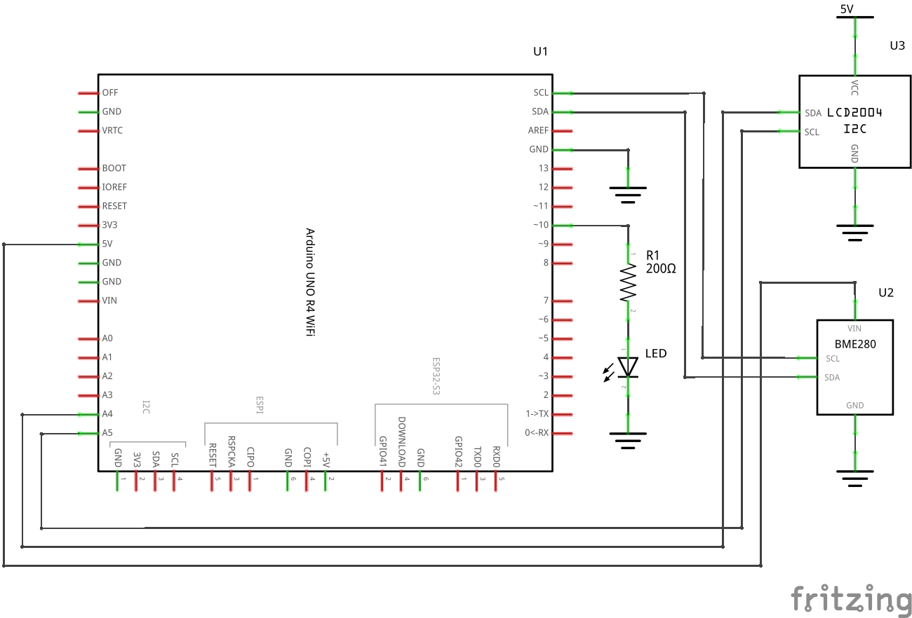

# Preface

This is a sample program for communication using the MQTT broker.  
 

MQTT communication using Qt6/C++ and Arduino UNO R4 WiFi.  
The application on the Qt6/C++ side is the Subscriber and the Arduino UNO R4 WiFi side is the Publisher.  
 

The LCD2004 and BME280 sensors are connected to the Arduino UNO R4 WiFi as shown in the figure  
below to send temperature, humidity, and barometric pressure to the subscriber.  

  
 

In this case, the MQTT topic name is “arduino/sensor”.  
 